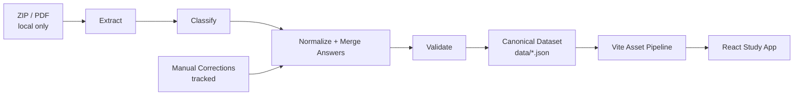
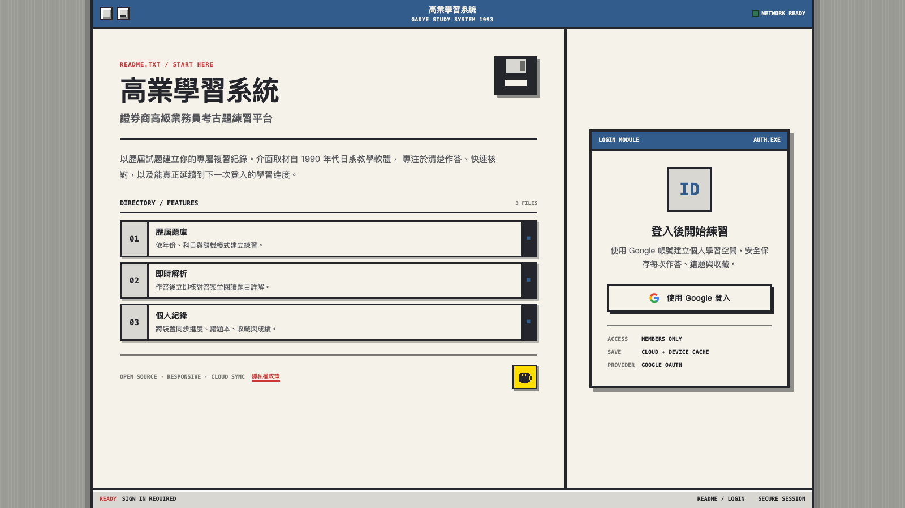
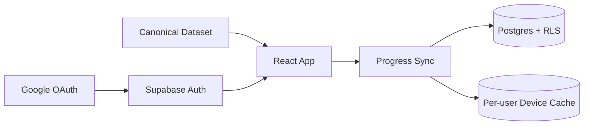

<div align="center">
  

  <h1>高業學習系統</h1>

  <p><strong>從歷屆試題 PDF，到可驗證題庫，再到能持續累積的個人學習紀錄。</strong></p>
  <p>證券商高級業務員題庫資料管線與開源練習平台。</p>

  <p>
    <a href="https://allenchenhan99.github.io/gaoye-study-system/"></a>
    <a href="https://github.com/allenchenhan99/gaoye-study-system/actions/workflows/deploy-pages.yml"></a>
  </p>
</div>

## 這個 repo 解決什麼

這不是只有介面的題庫網站。Repository 的上游核心是一套 Python 資料管線：從歷屆試題檔案進行解壓、分類、文字抽取、答案合併、人工修正與資料驗證，再發布為單一 canonical question bank。React 前端只負責消費這份資料，提供練習、模擬考與個人進度介面。



### 資料邊界

| 內容 | 儲存位置 | GitHub 是否包含 | 用途 |
| --- | --- | --- | --- |
| 原始 ZIP／PDF | 開發者本機 | 否 | Pipeline 輸入；因體積與來源限制不進版控 |
| 抽取、分類、驗證程式 | `scripts/` | 是 | 將來源資料轉為結構化題庫 |
| 人工答案與題目修正 | `data/manual-*.json` | 是 | 修正 OCR／圖片型答案與特殊題目 |
| 來源覆蓋契約 | `data/source-coverage.json` | 是 | 定義完整 ZIP 年份、PDF 數量與題目分布 |
| Canonical 題庫 | `data/questions.json`、`data/explanations.json` | 是 | Pipeline 的發布產物，也是前端唯一資料來源 |
| 個人作答進度 | Supabase Postgres | 否 | 依登入使用者保存，受 RLS 隔離 |
| 內部規劃文件 | 本機 `docs/plans`、`docs/superpowers` | 否 | 僅供本機開發，不參與建置或部署 |

瀏覽器不會讀取開發者電腦裡的 PDF 或內部文件。Vite 在 build 時將 canonical JSON 發布為帶雜湊的靜態資產，網站再透過 HTTP 載入；使用者進度則走 Supabase，而不是 GitHub。

## Data pipeline

```text
scripts/
├── bigzip.py             # 解開來源壓縮檔
├── classify.py           # 建立試題／答案檔 manifest
├── extract_questions.py  # 解析題幹與選項
├── extract_answers.py    # 解析文字型答案頁
├── build.py              # 合併答案、人工修正與完整題目
├── validate.py           # 找出缺答案、格式與品質問題
├── source_coverage.py    # 阻擋不完整來源、PDF 或題目分布
├── publish_dataset.py    # 產生瀏覽器使用的精簡 canonical dataset
└── run_pipeline.py       # 端到端 pipeline entry point
```

### 執行與驗證

原始考試 ZIP 不在 GitHub 內。要重建題庫，請先安裝 Python 3.12 與 Poppler（需要 `pdftotext`、`pdfinfo`、`pdfimages`），再將原始壓縮檔放在 repository root；檔名必須符合 `1*.zip`。

macOS：

```bash
brew install poppler
```

Ubuntu / Debian：

```bash
sudo apt-get install poppler-utils
```

接著執行：

```bash
python -m pip install -r requirements.txt
python -m scripts.run_pipeline
python -m pytest -q
```

`run_pipeline` 會把含來源欄位的中間資料留在被忽略的 `data/_pipeline/`。只有 ZIP 年份、PDF 清單與題目分布完整符合 `data/source-coverage.json`，且格式、答案、唯一 ID 及不縮水保護全部通過後，才會以原子替換更新受版本控制的 `data/questions.json`；任一步失敗都會保留上一版 canonical dataset。CI 會執行完整 Python test suite 與 canonical dataset contract，確保目前 5,400 題、答案格式、ID 語意一致及詳解對應關係成立。

## Learning app



介面取材自 1990 年代日系教學軟體。登入後，每位使用者只會看到自己的作答紀錄、收藏與統計；進度可跨裝置同步，短暫離線時由依使用者隔離的裝置快取承接。

| 練習 | 模擬考 | 複習 | 個人進度 |
| --- | --- | --- | --- |
| 依年份、科目或隨機抽題 | 50 題、60 分鐘完整流程 | 錯題本、收藏與逐題詳解 | Google 登入、跨裝置同步 |
| 即時判分與答案說明 | 交卷後統一顯示結果 | 依作答狀態快速篩選 | 科目統計與離線保護 |

### Runtime architecture



| Layer | Stack |
| --- | --- |
| Pipeline | Python 3.12 · pytest · Poppler/PDF tools |
| Web | React 18 · TypeScript · Vite · React Router |
| Auth | Supabase Auth · Google OAuth |
| Data | Static canonical JSON · Supabase Postgres · RLS |
| Testing | pytest · Vitest · React Testing Library · pgTAP |
| Delivery | GitHub Actions · GitHub Pages |

## 本機啟動前端

```bash
git clone https://github.com/allenchenhan99/gaoye-study-system.git
cd gaoye-study-system/frontend
npm ci
cp .env.example .env.development.local
npm run dev
```

設定 `frontend/.env.development.local`：

```dotenv
VITE_SUPABASE_URL=https://your-project-ref.supabase.co
VITE_SUPABASE_PUBLISHABLE_KEY=sb_publishable_your_key
```

`VITE_SUPABASE_PUBLISHABLE_KEY` 可放在前端；`service_role` key 與 OAuth client secret 不可進入瀏覽器環境或版本控制。

<details>
<summary><strong>Supabase 與 Google OAuth 設定</strong></summary>

1. 建立 Supabase 專案並執行 `supabase/migrations/`。
2. 在 Google Cloud Console 建立 Web OAuth client。
3. 將本機與正式網站加入 Authorized JavaScript origins。
4. 將 Supabase 提供的 callback URL 加入 Authorized redirect URIs。
5. 在 Supabase Auth Providers 啟用 Google 並設定 client ID／secret。
6. 在 Supabase URL Configuration 加入：
   - `http://localhost:5173/`
   - `https://allenchenhan99.github.io/gaoye-study-system/`

</details>

### 前端與資料庫測試

```bash
cd frontend
npm test
npm run build

cd ..
supabase db start
supabase test db supabase/tests/database/learning_progress_rls.test.sql
```

## Repository map

```text
gaoye-study-system/
├── data/                 # Canonical dataset 與人工修正
├── scripts/              # 題庫 extraction／validation／publishing pipeline
├── tests/                # Pipeline 與資料 contract 測試
├── frontend/             # Canonical dataset 的 React consumer
├── supabase/             # 個人進度 schema、RLS、RPC 與 pgTAP
└── .github/workflows/    # Pipeline quality gate 與 Pages deployment
```

## CI/CD quality gate

每次 push 到 `main` 後，GitHub Actions 會依序執行：

1. 啟動本機 Supabase，驗證 migration、RLS 與進度 RPC。
2. 執行完整 Python pipeline test suite、資料 contract 與 migration tests。
3. 執行 73 個前端測試。
4. 驗證正式 Supabase 公開設定與 Google provider。
5. 從 canonical dataset 建立 production assets。
6. 所有檢查通過後才部署 GitHub Pages。

## 資料與隱私

- 練習功能需要登入，公開首頁不會讀取個人學習資料。
- 個人資料表強制啟用 RLS，只允許存取與 `auth.uid()` 相符的紀錄。
- 雲端寫入使用冪等操作，避免斷線重送造成重複紀錄。
- 裝置快取依使用者 ID 隔離；登出時會結束 Supabase session。
- Google 登入只用於驗證身分與建立個人學習空間。

完整說明請見 [隱私權政策](https://allenchenhan99.github.io/gaoye-study-system/privacy.html)。

> [!NOTE]
> 題庫與詳解以考試複習為目的，可能因法規修訂、官方更正或資料整理而產生差異；應試時請以主管機關與正式考試公告為準。本專案不是主管機關或考試單位的官方服務。

## 回報問題

題目資料錯誤、詳解補充與功能建議，請透過 [GitHub Issues](https://github.com/allenchenhan99/gaoye-study-system/issues) 回報。

<div align="center">
  <a href="https://buymeacoffee.com/allenchenhan99"></a>
</div>
