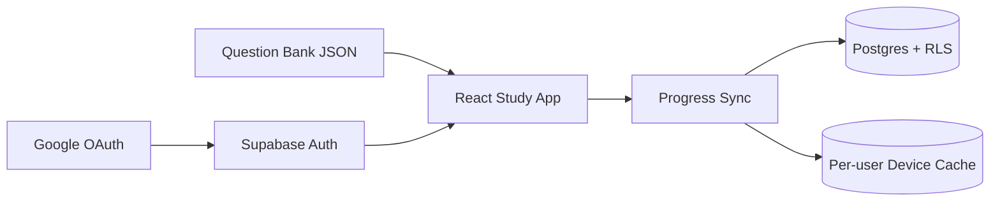

<div align="center">
  

  <h1>高業學習系統</h1>

  <p><strong>把歷屆試題，變成能持續累積的個人學習紀錄。</strong></p>
  <p>證券商高級業務員考古題練習平台 · A pixel study system built for focused practice.</p>

  <p>
    <a href="https://allenchenhan99.github.io/gaoye-study-system/"></a>
    <a href="https://github.com/allenchenhan99/gaoye-study-system/actions/workflows/deploy-pages.yml"></a>
  </p>
</div>


## 專案簡介

高業學習系統是一套為證券商高級業務員測驗打造的開源練習工具。它將歷屆題庫、即時解析、錯題回顧與個人進度放進同一個工作流程，並以 1990 年代日系教學軟體為視覺語言，減少一般題庫網站的干擾感。

登入後，每位使用者只會看到自己的作答紀錄、收藏與統計資料；進度可跨裝置同步，短暫離線時則由裝置快取承接。

## 核心功能

| 練習 | 模擬考 | 複習 | 個人進度 |
| --- | --- | --- | --- |
| 依年份、科目或隨機抽題 | 50 題、60 分鐘完整流程 | 錯題本、收藏與逐題詳解 | Google 登入、跨裝置同步 |
| 即時判分與答案說明 | 交卷後統一顯示結果 | 依答題狀態快速篩選 | 科目統計與本機離線保護 |

### 使用流程

1. 使用 Google 帳號登入個人學習空間。
2. 選擇年份、科目、隨機練習或模擬考。
3. 作答後檢查答案與詳解。
4. 回到錯題本、收藏與統計頁持續複習。

> [!NOTE]
> 題庫與詳解以考試複習為目的，可能因法規修訂、官方更正或資料整理而產生差異；應試時請以主管機關與正式考試公告為準。本專案不是主管機關或考試單位的官方服務。

## 系統架構



| Layer | Stack |
| --- | --- |
| Web | React 18 · TypeScript · Vite · React Router |
| UI | Tailwind CSS · 專案自有 Study System 元件 |
| Auth | Supabase Auth · Google OAuth |
| Data | Supabase Postgres · Row Level Security |
| Testing | Vitest · React Testing Library · pytest · pgTAP |
| Delivery | GitHub Actions · GitHub Pages |

## 本機開發

### 需求

- Node.js 20+
- npm
- Supabase 專案
- Google Cloud OAuth 2.0 Client
- Docker 與 Supabase CLI（僅本機資料庫／整合測試需要）

### 啟動前端

```bash
git clone https://github.com/allenchenhan99/gaoye-study-system.git
cd gaoye-study-system/frontend
npm ci
cp .env.example .env.development.local
npm run dev
```

設定 `frontend/.env.development.local`：

```dotenv
VITE_SUPABASE_URL=https://your-project-ref.supabase.co
VITE_SUPABASE_PUBLISHABLE_KEY=sb_publishable_your_key
```

`VITE_SUPABASE_PUBLISHABLE_KEY` 可放在前端；`service_role` key 與 OAuth client secret 不可進入瀏覽器環境或版本控制。

<details>
<summary><strong>Supabase 與 Google OAuth 設定</strong></summary>

1. 建立 Supabase 專案並執行 `supabase/migrations/`。
2. 在 Google Cloud Console 建立 Web OAuth client。
3. 將本機與正式網站加入 Authorized JavaScript origins。
4. 將 Supabase 提供的 callback URL 加入 Authorized redirect URIs。
5. 在 Supabase Auth Providers 啟用 Google 並設定 client ID／secret。
6. 在 Supabase URL Configuration 加入：
   - `http://localhost:5173/`
   - `https://allenchenhan99.github.io/gaoye-study-system/`

</details>

### 驗證

```bash
# 前端測試與正式建置
cd frontend
npm test
npm run build

# Python 題庫資料管線
cd ..
pytest

# Supabase migration 與 RLS
supabase db start
supabase test db supabase/tests/database/learning_progress_rls.test.sql
```

## 資料與隱私

- 練習功能需要登入，公開首頁不會讀取個人學習資料。
- 個人資料表強制啟用 RLS，只允許存取與 `auth.uid()` 相符的紀錄。
- 雲端寫入使用冪等操作，避免斷線重送造成重複紀錄。
- 裝置快取依使用者 ID 隔離；登出時會結束 Supabase session。
- Google 登入只用於驗證身分與建立個人學習空間。

完整說明請見 [隱私權政策](https://allenchenhan99.github.io/gaoye-study-system/privacy.html)。

<details>
<summary><strong>Repository map</strong></summary>

```text
gaoye-study-system/
├── data/                 # 人工校對答案與詳解來源
├── frontend/
│   ├── public/data/      # 正式網站載入的題庫
│   └── src/
│       ├── components/   # 共用 UI 元件
│       ├── hooks/        # 題庫、登入與雲端進度
│       ├── lib/          # 抽題、計分、型別與儲存邏輯
│       └── pages/        # 練習、模考、複習與統計
├── scripts/              # 題庫抽取、驗證與匯出管線
├── supabase/             # Migration、RLS 與 pgTAP 測試
└── tests/                # Python 資料管線測試
```

</details>

## 部署

Push 到 `main` 後，GitHub Actions 會先執行資料庫 contract、前端測試、Supabase 公開設定檢查與 production build；所有檢查通過後，才會把 `frontend/dist` 發布到 GitHub Pages。

正式環境需要在 repository variables 設定：

- `VITE_SUPABASE_URL`
- `VITE_SUPABASE_PUBLISHABLE_KEY`

## 回報問題

題目資料錯誤、詳解補充與功能建議，請透過 [GitHub Issues](https://github.com/allenchenhan99/gaoye-study-system/issues) 回報。

<div align="center">
  <a href="https://buymeacoffee.com/allenchenhan99"></a>
</div>
